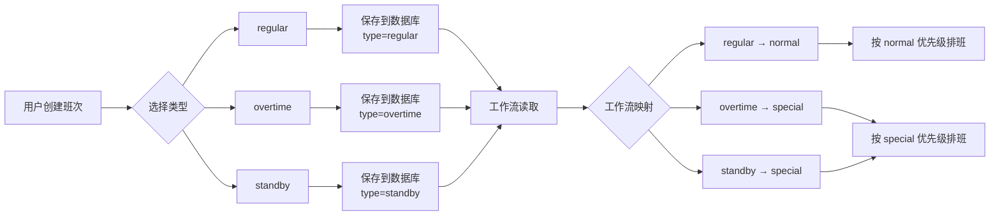

# 班次类型分类说明

## 概述

班次类型分为**用户可创建类型**和**系统/工作流类型**两大类。

## 类型分类

### 1. 用户可创建类型（前端表单）

这些是用户在创建和编辑班次时可以选择的类型：

| 代码 | 名称 | 说明 | 使用场景 |
|------|------|------|----------|
| `regular` | 常规班次 | 日常工作班次 | 白班、夜班等固定工作班次 |
| `overtime` | 加班班次 | 节假日或额外工作 | 周末值班、节假日加班 |
| `standby` | 备班班次 | 待命或应急班次 | 应急待命、备用人员 |

**前端位置**：班次管理 → 新增/编辑班次 → 类型下拉框

### 2. 系统/工作流类型（只读显示）

这些类型由系统自动生成或工作流内部使用，用户不能直接创建：

#### 2.1 后端映射类型

| 代码 | 名称 | 来源 | 说明 |
|------|------|------|------|
| `normal` | 普通班次 | 由 `regular` 映射 | 工作流中使用 |
| `special` | 特殊班次 | 由 `overtime/standby` 映射 | 工作流中优先处理 |

#### 2.2 工作流内部类型

| 代码 | 名称 | 用途 | 排班优先级 |
|------|------|------|-----------|
| `fixed` | 固定班次 | 固定人员配置 | 最高（10） |
| `research` | 科研班次 | 科研学习时间 | 较低（70） |
| `fill` | 填充班次 | 补充排班不足 | 最低（90） |

## 前端实现

### 表单选项（创建/编辑）

```typescript
// logic.ts
export const typeOptions: TypeOption[] = [
  { label: '常规班次', value: 'regular' },
  { label: '加班班次', value: 'overtime' },
  { label: '备班班次', value: 'standby' },
]
```

**使用位置**：
- `ShiftForm.vue` - 创建/编辑表单的类型选择

### 筛选选项（列表筛选）

```typescript
// logic.ts
export const allTypeOptions: TypeOption[] = [
  { label: '常规班次', value: 'regular' },
  { label: '普通班次', value: 'normal' },      // 系统类型
  { label: '加班班次', value: 'overtime' },
  { label: '特殊班次', value: 'special' },      // 系统类型
  { label: '备班班次', value: 'standby' },
  { label: '固定班次', value: 'fixed' },        // 工作流类型
  { label: '科研班次', value: 'research' },     // 工作流类型
  { label: '填充班次', value: 'fill' },         // 工作流类型
]
```

**使用位置**：
- `index.vue` - 班次列表页面的类型筛选下拉框

### 显示映射（通用）

```typescript
// logic.ts
export function getTypeText(type: string): string {
  const map: Record<string, string> = {
    'regular': '常规',
    'normal': '普通',
    'overtime': '加班',
    'special': '特殊',
    'standby': '备班',
    'fixed': '固定',
    'research': '科研',
    'fill': '填充',
  }
  return map[type] || type
}
```

**使用位置**：
- 所有需要显示班次类型文本的地方

## 工作流处理顺序

排班工作流按以下顺序处理不同类型的班次：

```
1. fixed (10)     - 固定班次，自动填充固定人员
2. 个人需求处理
3. special (30)   - 特殊班次（包含 overtime, standby）
4. normal (50)    - 普通班次（包含 regular）
5. research (70)  - 科研班次
6. fill (90)      - 填充班次，补充排班不足
```

## 类型转换流程



## 前端页面对照

### 创建/编辑班次表单

```
班次管理 → 新增班次 / 编辑
┌─────────────────────────┐
│ 班次类型: [下拉选择]     │
│   ├─ 常规班次           │
│   ├─ 加班班次           │
│   └─ 备班班次           │  ← 只显示这3个选项
└─────────────────────────┘
```

### 班次列表筛选

```
班次管理 → 筛选
┌─────────────────────────┐
│ 类型: [下拉选择]         │
│   ├─ 常规班次           │
│   ├─ 普通班次           │  ← 可以看到
│   ├─ 加班班次           │
│   ├─ 特殊班次           │  ← 可以看到
│   ├─ 备班班次           │
│   ├─ 固定班次           │  ← 可以看到
│   ├─ 科研班次           │  ← 可以看到
│   └─ 填充班次           │  ← 可以看到
└─────────────────────────┘
```

### 班次列表显示

```
班次管理 → 列表
┌─────────────────────────────────┐
│ 名称  │ 类型    │ 时间 │ ...    │
├───────┼─────────┼──────┼────────┤
│ 白班  │ 常规    │ ...  │ ...    │
│ 夜班  │ 普通    │ ...  │ ...    │  ← 后端返回可显示
│ 周末班│ 加班    │ ...  │ ...    │
│ 急诊班│ 特殊    │ ...  │ ...    │  ← 后端返回可显示
└─────────────────────────────────┘
```

## 注意事项

1. **用户创建限制**：用户只能创建 regular、overtime、standby 三种类型
2. **后端映射**：后端可能将 regular 映射为 normal 返回
3. **工作流类型**：fixed、research、fill 等类型由工作流或系统生成
4. **显示兼容**：前端显示函数支持所有类型，确保兼容性
5. **筛选全面**：列表筛选包含所有类型，方便查找

## FAQ

### Q1: 为什么我创建的是"常规班次"，列表显示"普通班次"？

A: 后端工作流会将 `regular` 映射为 `normal`，这是正常的。两者在业务上是等价的。

### Q2: "固定班次"、"科研班次"在哪里创建？

A: 这些类型不是通过手动创建的：
- `fixed`：由固定人员配置自动生成
- `research`、`fill`：由工作流在特定场景下创建

### Q3: 为什么筛选里能看到这么多类型？

A: 筛选需要支持查找所有可能存在的班次，包括系统生成的类型。

### Q4: 编辑班次时能改类型吗？

A: 可以，但只能在 regular、overtime、standby 三者之间切换。

---

**文档版本**：v1.0  
**更新时间**：2025-12-17

