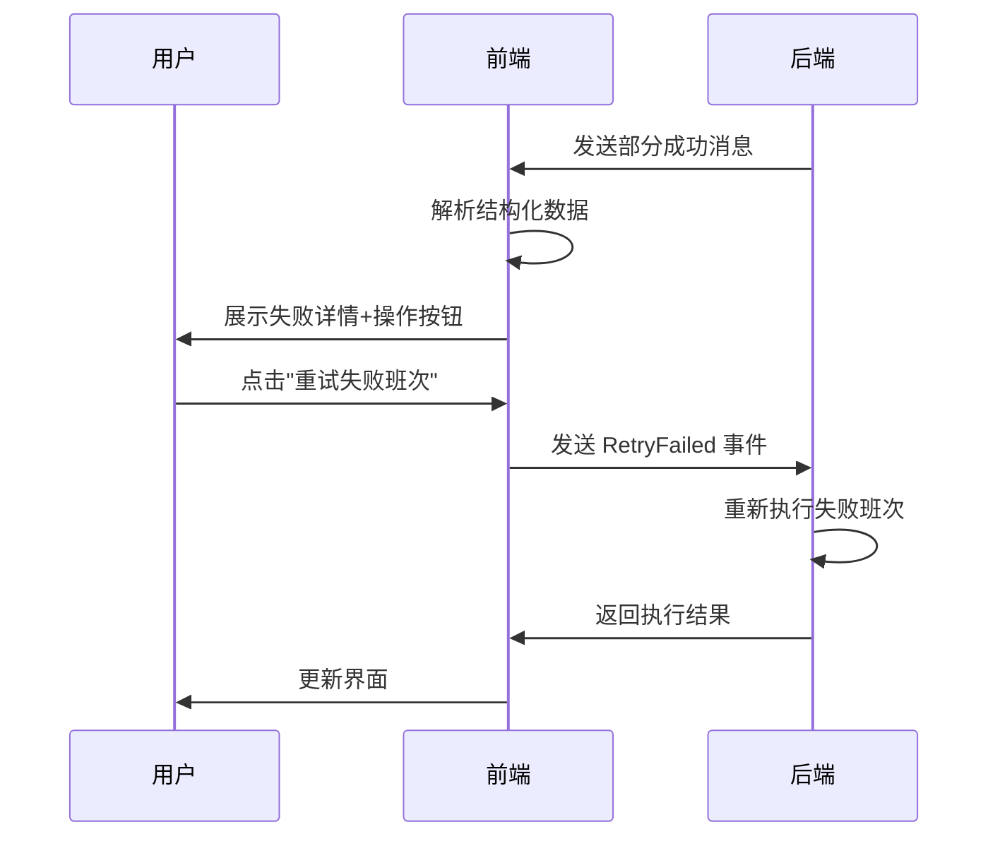

# V3排班部分成功状态前端集成指南

## 概述

本指南说明如何在前端集成V3排班单班次自动重试机制的部分成功状态处理。

## 一、新增类型定义

已在 `src/types/schedule.ts` 中添加以下类型：

### 1. ShiftFailureInfo - 班次失败信息
```typescript
export interface ShiftFailureInfo {
  shiftId: string // 班次ID
  shiftName: string // 班次名称
  failureSummary: string // 失败摘要
  autoRetryCount: number // 自动重试次数
  manualRetryCount: number // 手动重试次数
  failureHistory?: string[] // 历史失败记录
  lastError?: string // 最后错误
  validationIssues?: Array<{ // 校验问题列表
    type: string
    description: string
    severity: string
  }>
}
```

### 2. TaskResult - 任务执行结果
```typescript
export interface TaskResult {
  taskId: string
  success: boolean
  partiallySucceeded?: boolean // 是否部分成功
  successfulShifts?: string[] // 成功的班次ID列表
  failedShifts?: Record<string, ShiftFailureInfo> // 失败班次详情
  error?: string
  executionTime?: number
  metadata?: Record<string, any>
}
```

### 3. PartialSuccessMessageData - 结构化消息数据
```typescript
export interface PartialSuccessMessageData {
  type: 'partial_success'
  successCount: number
  failedCount: number
  failedShifts: ShiftFailureInfo[]
  options: Array<{
    action: 'retry' | 'skip' | 'cancel'
    label: string
    event: string
  }>
}
```

## 二、新增事件类型

已在 `src/types/event.ts` 中添加以下事件：

```typescript
enum WorkFlowEventType {
  // ... 其他事件 ...

  // V3 Core 子工作流 - 部分成功处理事件
  Schedule_V3_Core_RetryFailed = '_schedule_v3_core_retry_failed_',
  Schedule_V3_Core_SkipFailed = '_schedule_v3_core_skip_failed_',
  Schedule_V3_Core_CancelTask = '_schedule_v3_core_cancel_task_',
}
```

## 三、后端消息格式

后端发送的部分成功消息包含两部分：

1. **用户可读文本**（兼容旧版前端）
2. **结构化JSON数据**（嵌入在HTML注释中）

### 消息格式示例：
```
⚠️ **部分班次执行失败**

✅ 成功完成：8 个班次
❌ 失败班次：2 个

**失败详情：**
- **早班**：安排了3人但需要5人（已自动重试3次）
- **晚班**：存在时间冲突（已自动重试3次）

请选择操作：
[重试失败班次] [跳过失败班次，保存成功部分] [取消整个任务]

<!-- STRUCTURED_DATA: {"type":"partial_success","successCount":8,...} -->
```

## 四、前端实现步骤

### Step 1: 消息解析（聊天消息处理组件）

```typescript
// 在聊天消息组件中检测并解析部分成功消息
function parseMessage(messageText: string): {
  text: string
  structuredData?: PartialSuccessMessageData
} {
  // 提取结构化数据
  const match = messageText.match(/<!-- STRUCTURED_DATA: (.+?) -->/)
  if (match) {
    try {
      const structuredData = JSON.parse(match[1]) as PartialSuccessMessageData
      const text = messageText.replace(/<!-- STRUCTURED_DATA: .+? -->/, '').trim()
      return { text, structuredData }
    }
    catch (e) {
      console.error('Failed to parse structured data:', e)
    }
  }
  return { text: messageText }
}
```

### Step 2: 渲染部分成功消息（Vue组件示例）

```vue
<script setup lang="ts">
import type { PartialSuccessMessageData } from '@/types/schedule'
import { computed } from 'vue'
import WorkFlowEventType from '@/types/event'

interface Props {
  messageText: string
}

const props = defineProps<Props>()

// 解析消息
const { text: messageHtml, structuredData: partialSuccessData } = computed(() =>
  parseMessage(props.messageText)
).value

// 处理用户操作
function handleAction(option: PartialSuccessMessageData['options'][0]) {
  // 发送对应的工作流事件
  sendWorkflowEvent(option.event)
}

// 发送工作流事件到后端
async function sendWorkflowEvent(eventType: string) {
  try {
    await fetch('/api/workflow/event', {
      method: 'POST',
      headers: { 'Content-Type': 'application/json' },
      body: JSON.stringify({
        sessionId: currentSessionId,
        event: eventType,
        payload: {}
      })
    })
  }
  catch (error) {
    console.error('Failed to send workflow event:', error)
  }
}
</script>

<template>
  <div class="message-container">
    <!-- 基础文本消息 -->
    <div class="message-text" v-html="messageHtml" />

    <!-- 部分成功交互界面 -->
    <div v-if="partialSuccessData" class="partial-success-panel">
      <div class="success-stats">
        <div class="stat success">
          <CheckCircleIcon />
          <span>成功：{{ partialSuccessData.successCount }} 个班次</span>
        </div>
        <div class="stat failed">
          <XCircleIcon />
          <span>失败：{{ partialSuccessData.failedCount }} 个班次</span>
        </div>
      </div>

      <!-- 失败详情 -->
      <div class="failed-shifts-detail">
        <h4>失败班次详情</h4>
        <div
          v-for="failInfo in partialSuccessData.failedShifts"
          :key="failInfo.shiftId"
          class="failed-shift-item"
        >
          <div class="shift-name">
            {{ failInfo.shiftName }}
          </div>
          <div class="failure-summary">
            {{ failInfo.failureSummary }}
          </div>
          <div class="retry-count">
            已自动重试 {{ failInfo.autoRetryCount }} 次
          </div>

          <!-- 展开查看详细错误（可选） -->
          <details v-if="failInfo.failureHistory?.length">
            <summary>查看重试历史</summary>
            <ul class="failure-history">
              <li v-for="(history, idx) in failInfo.failureHistory" :key="idx">
                {{ history }}
              </li>
            </ul>
          </details>
        </div>
      </div>

      <!-- 操作按钮 -->
      <div class="action-buttons">
        <button
          v-for="option in partialSuccessData.options"
          :key="option.action"
          class="action-btn" :class="[`action-${option.action}`]"
          @click="handleAction(option)"
        >
          {{ option.label }}
        </button>
      </div>
    </div>
  </div>
</template>

<style scoped>
.partial-success-panel {
  margin-top: 16px;
  padding: 16px;
  border-radius: 8px;
  background: #fff5e6;
  border: 1px solid #ffa940;
}

.success-stats {
  display: flex;
  gap: 24px;
  margin-bottom: 16px;
}

.stat {
  display: flex;
  align-items: center;
  gap: 8px;
  font-size: 14px;
}

.stat.success { color: #52c41a; }
.stat.failed { color: #ff4d4f; }

.failed-shifts-detail {
  margin: 16px 0;
  padding: 12px;
  background: white;
  border-radius: 4px;
}

.failed-shift-item {
  padding: 12px;
  margin-bottom: 8px;
  border-left: 3px solid #ff4d4f;
  background: #fff1f0;
}

.shift-name {
  font-weight: 600;
  margin-bottom: 4px;
}

.failure-summary {
  color: #666;
  font-size: 13px;
  margin-bottom: 4px;
}

.retry-count {
  color: #999;
  font-size: 12px;
}

.action-buttons {
  display: flex;
  gap: 12px;
  margin-top: 16px;
}

.action-btn {
  padding: 8px 16px;
  border-radius: 4px;
  border: none;
  cursor: pointer;
  font-size: 14px;
  transition: all 0.3s;
}

.action-retry {
  background: #1890ff;
  color: white;
}

.action-skip {
  background: #52c41a;
  color: white;
}

.action-cancel {
  background: #ff4d4f;
  color: white;
}

.action-btn:hover {
  opacity: 0.8;
}
</style>
```

### Step 3: 集成到现有聊天组件

在现有的聊天消息渲染逻辑中：

```typescript
// 在聊天消息列表渲染时
messages.forEach((msg) => {
  const { text, structuredData } = parseMessage(msg.content)

  if (structuredData?.type === 'partial_success') {
    // 渲染部分成功专用组件
    renderPartialSuccessMessage(text, structuredData)
  }
  else {
    // 渲染普通消息
    renderNormalMessage(text)
  }
})
```

## 五、事件处理流程



## 六、测试场景

### 场景1：部分成功后重试成功
1. 10个班次，8个成功，2个失败
2. 展示部分成功界面
3. 用户点击"重试失败班次"
4. 重试后全部成功
5. 显示完成状态

### 场景2：部分成功后跳过失败
1. 部分班次失败
2. 用户点击"跳过失败班次，保存成功部分"
3. 只保存成功的8个班次
4. 显示完成状态（带警告提示）

### 场景3：多次重试仍失败
1. 重试后仍有失败
2. 再次进入部分成功状态
3. 用户可继续重试或跳过

## 七、配置说明

后端配置文件 `config/agents/rostering-agent.yml`：

```yaml
schedule_v3:
  retry:
    max_shift_retries: 3 # 自动重试次数（默认3）
    enable_ai_analysis: true # 是否启用AI分析（默认true）
    stop_on_all_failed: false # 全失败时是否停止（默认false）
    semantic_history_format: brief # 历史格式（brief/detailed）
```

## 八、注意事项

1. **兼容性**：保留了纯文本格式，未升级的前端仍能显示基本信息
2. **性能**：结构化数据使用HTML注释嵌入，不影响文本显示
3. **错误处理**：JSON解析失败时降级为纯文本显示
4. **无限重试**：手动重试不限次数，需要前端做好防重复点击
5. **样式定制**：可根据项目UI规范调整组件样式

## 九、后续优化建议

1. 添加失败班次的可视化日历展示
2. 支持单独重试某个失败班次（而非全部失败班次）
3. 添加重试进度指示器
4. 支持导出失败班次详情报告
5. 添加失败原因的智能分类和解决方案推荐
